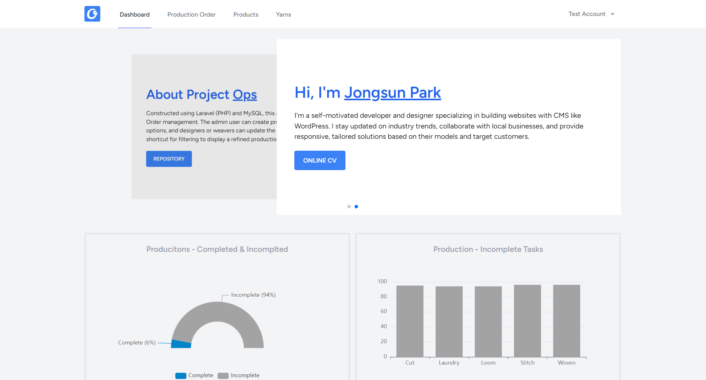
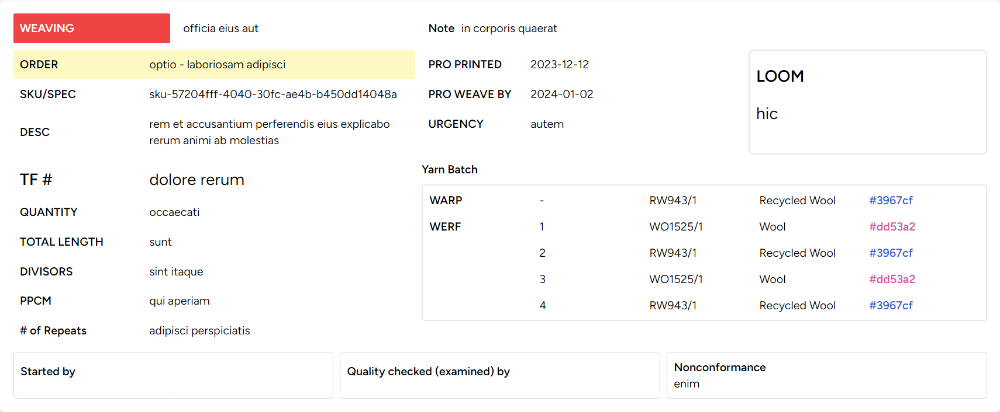
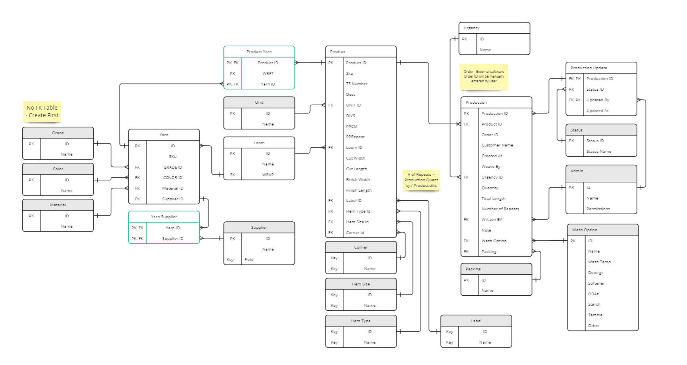

# OPS

## Order Production Management System

OPS, a production order system seamlessly integrated with Laravel and React, boasts role-based database access for tailored user experiences. Hosted on Digital Ocean and meticulously managed on GitHub, it combines robust functionality with reliable performance, emphasizing a commitment to excellence in production order management.

### Challenges in Production Tracking: Transitioning from Excel to a Robust Integrated System

The comprehensive demands of the production workflow necessitated a meticulous tracking of process details, a task initially managed through Microsoft Excel. However, as the production process became increasingly interconnected with various files and data sources, the limitations of Excel became evident. The complexity of relationships between different files presented challenges for the main production file in maintaining and organizing data effectively.

Simultaneously, issues arising from partially updated data compromised the reliability and accuracy of the tracking process, raising concerns about the integrity of information crucial for making informed production decisions. Recognizing these challenges, there was a realization that transitioning from Excel to a more robust and integrated system was imperative to streamline the production tracking process and meet the evolving demands of the workflow.

### Solutions

I have a task at hand that involves the comprehensive transfer of data from Excel to a database. The objective is not only to execute a seamless migration but also to establish a system that facilitates easy and efficient maintenance going forward. This entails a careful consideration of data structures, relationships, and dependencies to ensure that the transition is not only successful but also sets the stage for a streamlined and easily manageable database. By addressing these aspects, the goal is to create a robust and organized database environment that enhances data accessibility, integrity, and overall maintenance efficiency.

## Tech Stacks

- PHP & [Laravel](https://laravel.com/docs/10.x/) - Backend & API
- JavaScript & [React](https://react.dev/) & [Inertiajs](https://inertiajs.com/) - Frontend
- [tailwindcss](https://tailwindcss.com/) - CSS framework
- [echarts](https://echarts.apache.org/en/index.html) - Chart Library
- [framer](https://www.framer.com/) - Animation
- [Digital Ocean](https://try.digitalocean.com/) - Deploment

## Policies

Distinct permissions are assigned to each role, with their implementation executed through Laravel policies.

The administrator possesses comprehensive access, including the ability to delete items and add users. Designers are empowered to create products and production orders, while Updators can update order statuses. Guests are granted read-only access to production and product details.

## Production Order

The Production Order Preview encompasses output data distributed across multiple tables, incorporating detailed information about products within the yarn data. Additionally, it tracks the status of the production order, a parameter that can be updated by users with the Updator role.

## Tables

Yarn

- colour: hex string, entered by user
- sku: generated from material code, yarn number, core and nm
- material: imported from material table
- yarn number: number, entered by user
- yurn core: number, entered by user
- nm: number, entered by user

Product

- name: product name
- sku: generated from product attributeds
- description: string, entered by user
- tf: string, entered by user
- colour: hex string, entered by user
- loom: imported from loom table
- yarns: 4 yarns linked to yarn table
- cut (w/h): string, entered by user
- finish (w/h): string, entered by user
- hem_size: imported from hem size table
- hem_type: imported from hem type table
- label: imported from label table
- corner: imported from corenr table

Production

- product: imported from product table
- wash_option: imported from wash option table
- status: imported from status table
- other options: string, entered by user

Status

- linked to one production order
- cut & luarndy & loom & stitch & woven
- updated_by: imported from user
- updated_at: date time, updated date

## Ongoing Projects: Seeking Suggestions for Performance and User Experience Enhancements

These projects are currently in progress, with numerous tasks aimed at enhancing performance and user experiences. If you have any suggestions, please feel free to send me messages. Thank you.

What is in mind

- Consider using API instead of sending data as props via Inertia
- Enhance UI components for the List view
- Implement email notifications for status updates
- Code Splitting
